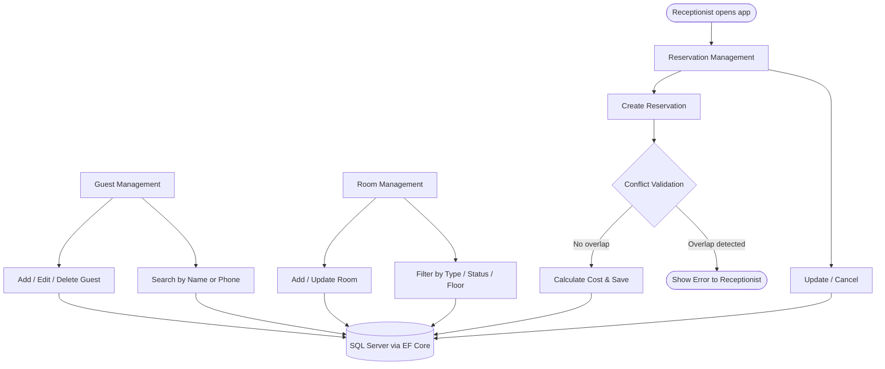

# 🏨 NovaStay Hotel Reservation System

NovaStay Hotel is a modern **WPF (Windows Presentation Foundation)** application designed to streamline hotel operations.  
It allows receptionists to manage rooms, guests, and reservations efficiently through a clean, responsive interface powered by **Telerik UI** and backed by **Entity Framework Core** and **SQL Server**.


---

## 🚀 Features

### 🧑‍💼 Guest Management
- Add, edit, and delete guest records
- Search guests by name or phone number
- Store nationality, passport number, date of birth, and contact details

### 🏠 Room Management
- Add and update room details (number, type, floor, price, balcony, status)
- Filter rooms by type, status, floor, or price range
- Track room maintenance and availability

### 📅 Reservation Management
- Create, update, or cancel reservations with conflict validation
- Automatically calculate total cost based on room price, nights stayed, and discounts
- Validate booking periods and enforce business rules (date overlaps, room availability)
- Track reservation status: **Created** → **Checked In** → **Checked Out** / **Canceled**

---

## 🧠 Technologies Used

| Layer | Technology |
|---|---|
| Frontend (UI) | WPF (C#), Telerik UI for WPF |
| Backend | C# (.NET 8), Entity Framework Core |
| Database | Microsoft SQL Server |
| Architecture | Clean Layered Architecture (Models, Services, Data Context) |
| Testing | Unit tests for services and database validation |

---

## ⚙️ How It Works



---

## 🗃️ Database & Entity Framework

- ORM: **Entity Framework Core** with code-first migrations
- Database auto-created and migrated on first run
- Every entity tracks `CreatedAt` and `UpdatedAt` timestamps
- Validation logic enforced at both the service and database layers

---

## 🧰 Key Service Classes

### `GuestService.cs`
Handles all CRUD operations and input validation for hotel guests.

### `RoomService.cs`
Manages room records, availability filtering, and conflict detection.

### `ReservationService.cs`
The core business logic layer — handles:
- Availability checks before booking
- Date overlap detection across existing reservations
- Base and final amount calculation (room rate × nights + discounts)
- Status transitions: Created → Checked In → Checked Out / Canceled
- Business rule enforcement and exception handling

---

## 🧪 Testing

Each service was tested for:
- Database integration via EF Core
- Business rule validation (overlaps, invalid dates, missing fields)
- Error handling and exception propagation

---

## 🎨 UI & UX

Built with **Telerik WPF controls** for a polished, modern desktop experience.

Four main pages:
1. **Home Page** — navigation hub and quick overview
2. **Guest Management Page** — full guest CRUD with search
3. **Room Management Page** — room listing, filters, and status tracking
4. **Reservation Management Page** — booking lifecycle management

---

## 📚 What I Learned

- **Layered architecture in practice** — separating UI, business logic, and data access into distinct layers made the codebase significantly easier to test and extend
- **EF Core code-first migrations** — managing schema evolution without touching SQL directly, and understanding when migrations can go wrong
- **Conflict detection logic** — implementing date overlap checks correctly (off-by-one errors are common here) and surfacing meaningful errors to the user
- **Telerik WPF components** — working with a professional UI library taught me how to balance customisation with convention
- **Unit testing services** — writing tests against EF Core with an in-memory database before touching the real SQL Server instance

---

## 🚀 How It Could Be Improved

| Area | Current State | Improvement |
|---|---|---|
| Platform | Desktop only (WPF) | Add a web version with ASP.NET Core + Vue.js |
| Auth | Single receptionist role | Add role-based login (receptionist vs manager vs admin) |
| Reporting | None | Add PDF invoice and occupancy report generation |
| Payments | Not implemented | Integrate a payment module with receipt tracking |
| Notifications | None | Add email/SMS confirmation on booking |
| Deployment | Local machine only | Package as an installer (MSIX) for easy distribution |
| Real-time | None | Add live room status updates across multiple terminals |

---

## 🎥 Demo

> 📹 Video walkthrough coming soon — will cover guest creation, room filtering, and full reservation lifecycle.

---

## 🏁 Getting Started

### Prerequisites
- Visual Studio 2022+
- .NET 8 SDK
- SQL Server (LocalDB or full instance)
- Telerik UI for WPF license (trial works for evaluation)

### Installation

```bash
git clone https://github.com/Anasmardoud/novastay-hotel-system
```

1. Open `NovaStay.sln` in Visual Studio
2. Update the connection string in `appsettings.json` to point to your SQL Server instance
3. Open the Package Manager Console and run:
```
Update-Database
```
4. Press **F5** to build and run

---

## 🧍 Author

**Anas Mardoud**  
Backend & Desktop Application Developer  
📧 anas.mardoud.cs@gmail.com  
🌐 [LinkedIn](https://www.linkedin.com/in/anas-mardoud-47996222a/)  
🐙 [GitHub](https://github.com/Anasmardoud)

---

> "A reliable, efficient, and elegant WPF application for hotel management built with .NET, EF Core, and SQL Server."
